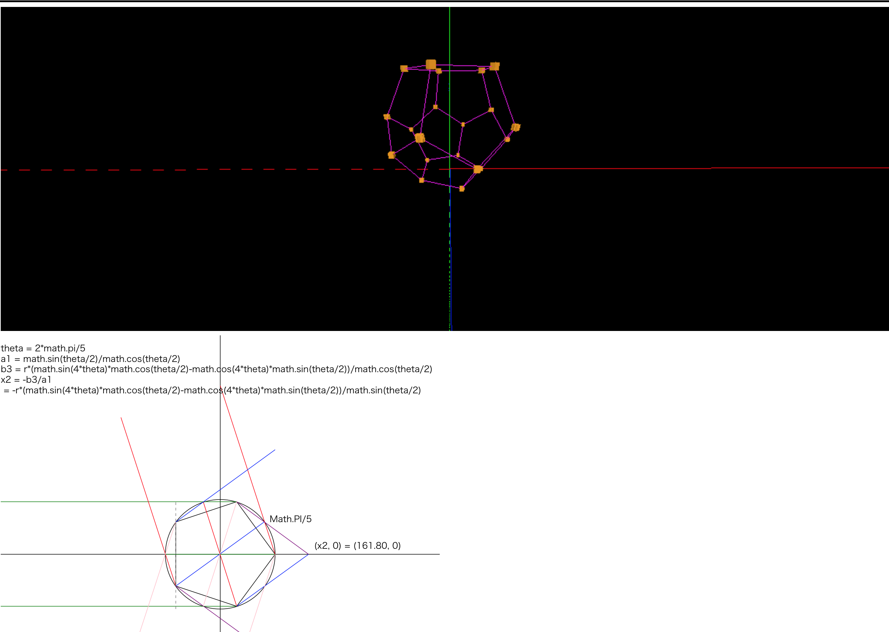

[three.js](https://threejs.org/) sample
==========================================

How to start
------------
browse html using web browser except IE

Contents
--------
1. texture on cylinder [greentea.html](greentea.html) 
  * browse on [raw.githack.com](https://rawcdn.githack.com/mamewotoko/threejs_sample/f6dd2b76db7098ef19918a5cf04ba33aaffc06a5/greentea.html)
  * using MeshFaceMaterial for CylinderGeometry (which has many segments)

2. matrix plot [matrix_plot/matrix_plot.html](matrix_plot/matrix_plot.html)
  * browse on [raw.githack.com](https://rawcdn.githack.com/mamewotoko/threejs_sample/f6dd2b76db7098ef19918a5cf04ba33aaffc06a5/matrix_plot/matrix_plot.html)
  * plot values on matrix

3. GUI that changes color / paramters [various_tea/tea.html](various_tea/tea.html)

4. [regular polyhedrons](https://en.wikipedia.org/wiki/Regular_polyhedron)
    * [Regular tetrahedron(4)](https://rawcdn.githack.com/mamewotoko/threejs_sample/f6dd2b76db7098ef19918a5cf04ba33aaffc06a5/graphics/4/regular_tetrahedron.html)
    * [Regular hexahedron(6)](https://rawcdn.githack.com/mamewotoko/threejs_sample/f6dd2b76db7098ef19918a5cf04ba33aaffc06a5/graphics/6/box.html)
    * [Regular octahedron(8)](https://rawcdn.githack.com/mamewotoko/threejs_sample/f6dd2b76db7098ef19918a5cf04ba33aaffc06a5/graphics/8/regular_octahedron.html)
    * [Regular dodecahedron(12)](https://rawcdn.githack.com/mamewotoko/threejs_sample/f6dd2b76db7098ef19918a5cf04ba33aaffc06a5/graphics/12/regular_dodecahedron.html)
    * [Regular Icosahedron(20)](https://rawcdn.githack.com/mamewotoko/threejs_sample/f6dd2b76db7098ef19918a5cf04ba33aaffc06a5/graphics/20/regular_icosahedron.html)
    * [Truncated Icosahedron](https://rawcdn.githack.com/mamewotoko/threejs_sample/f6dd2b76db7098ef19918a5cf04ba33aaffc06a5/graphics/12/regular_dodecahedron.html)

5. [cardboard sample (HMD, VR, StereoVR, DeviceOrientation)](https://rawcdn.githack.com/mamewotoko/threejs_sample/f6dd2b76db7098ef19918a5cf04ba33aaffc06a5/greentea_hmd.html)
  * Note: fullscreen
     * hide home touch button for browser to hide back/home/switch app button of android
     * select fullscreen config of browser to hide status bar
     * uncheck tool bar config of browser to hide tool bar
     * scroll down to bottom of page to hide url bar
6. Gamepad API(https://rawcdn.githack.com/mamewotoko/threejs_sample/f6dd2b76db7098ef19918a5cf04ba33aaffc06a5/control/greentea.html)
  * PS3 controller, index 0

TODO
----
* add mouse control
  * go forward, back, left, right, up, down
* display full screen easily (hmd)
* optimize initial position of hmd version
* smoothing?

Reference
----------
* [three.js](https://threejs.org/)
* [raw.githack.com](https://raw.githack.com/) 
  * _raw.githack.com serves raw files directly from GitHub, Bitbucket or GitLab with proper Content-Type headers_

----
Takashi Masuyama <mamewotoko@gmail.com>  
http://mamewo.ddo.jp/
