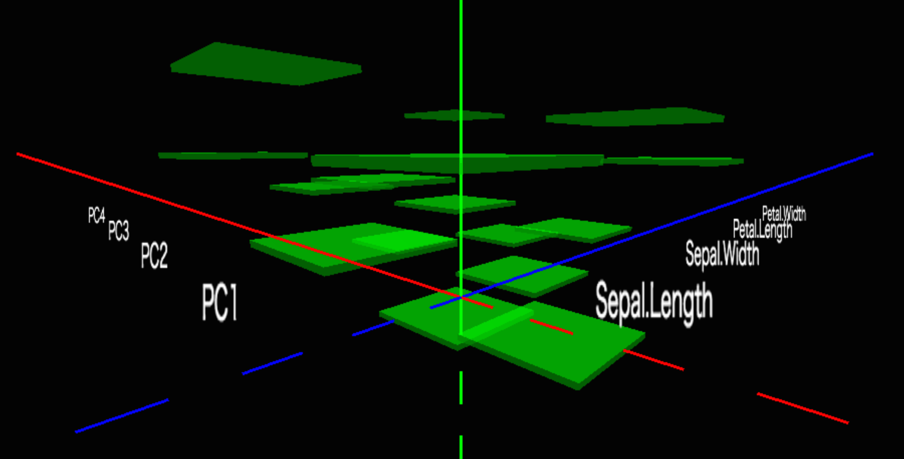

matrix plot
===========

sample1. plot coefficient matrix

Reference
---------
* R: image function in graphics package
* matshow function of Matplotlib (python scikit-learn)

Takashi Masuyama mamewotoko@gmail.com

